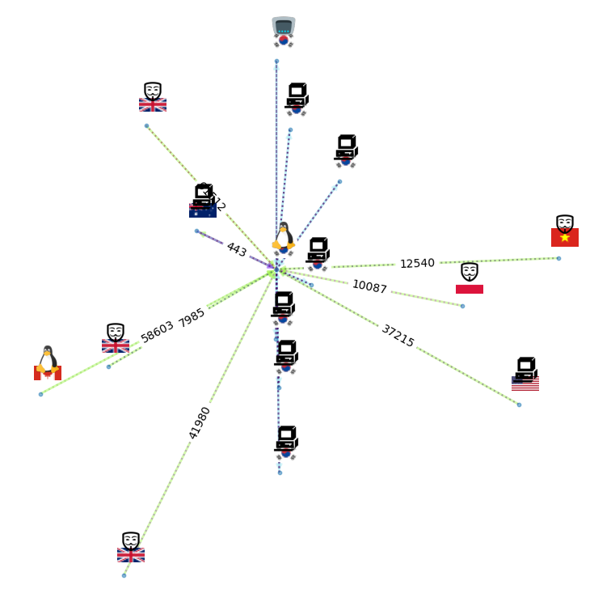

## p0ing


passive online interactive network graph


graph visualization tool for passive network recon, attack surface monitoring. 
Primarily uses ``p0f``  to collect data and networkx to organize it. visualization in pyvis(as a static webapp) and networkx builtins(as a tkint interface)

requirements
------------

this should about cover it. tkinter needs to be installed by apt it seems  

```
apt install geoip-bin libpcap-dev python3-tk curl build-essential
pip install networkx
pip install customtkinter
pip install numpy
pip install matplotlib
pip install basemap
pip install pyvis
```

build
-----

``./build.sh`` - inits + updates the submodule for p0f and builds it with its own build script

env vars
--------

- ``TKINT`` - ``true`` default, show tkinter interface, otherwise just generate pyvis html
- ``EDGE_COLOR_BY_BG`` - background edge(the edges are overlapping 50% transparency and foreground edge is dashed. defaults to ``group``
- ``EDGE_COLOR_BY``  - color edge by data field ``port, group, app, dist, link, mod`` defaults to ``port``. color is generated from hash of field values
- ``GEOPLOT``- plot on map? (not totally passive, sends traffic to ipinfo
- ``REPLOT`` -  time between refresh in seconds
- ``LABELS`` -  bool plot node labels(ips) in pic
- ``IPINFOTOKEN`` - ipinfo auth token, can go in .env, only used in geoplot. 





Icons
-----

Icons are kindly provided by [Icons8](https://icons8.com), a great resource. 

- [Cisco router](https://icons8.com/icon/11854/cisco-router)
- [Windows XP](https://icons8.com/icon/17854/windows-xp)
- [Linux](https://icons8.com/icon/HF4xGsjDERHf/linux)
- [Mac](https://icons8.com/icon/12344/mac-client)
- [Android](https://icons8.com/icon/17836/android-os)
- [FreeBSD](https://icons8.com/icon/17840/freebsd)
- [Guy Mask](https://icons8.com/icon/6Tw2cpO8bmZr/anonymous-mask)
- [My Computer](https://icons8.com/icon/58308/my-computer)
- [Blowfish](https://icons8.com/icon/J4pvtOD971RL/blow-fish)
- [Sun](https://icons8.com/icon/8LM7-CYX4BPD/sun)
- [Windows 95](https://icons8.com/icon/mdhenbUr2yHg/windows-95)
- [Phishing](https://icons8.com/icon/GUKg8L0_GkKJ/phishing)
- [James B](https://icons8.com/icon/0OkuSBmfHaSz/james-brown)

